# Arquitectura del Proyecto

## 2. Visión general

Este documento describe la arquitectura del sistema asistente de trabajo especial: un conjunto de servicios **desacoplados** que colaboran para ofrecer interacción con el usuario, orquestación de inteligencia artificial y procesamiento de datos y modelos.

**FastAPI** actúa como capa de exposición (API HTTP versionada en **`v1` y `v2`**, WebSockets y punto de entrada principal para las interacciones del usuario). La **orquestación inteligente** (flujos conversacionales, estados, herramientas y cadenas con LLMs) se concentra en **LangChain** y **LangGraph**, integrados en el backend pero separados conceptualmente de los routers y de la lógica de presentación HTTP/WebSocket.

El objetivo es mantener límites claros entre interfaz, API, IA, datos y machine learning, y facilitar el despliegue local homogéneo mediante contenedores.

---

## 3. Diagrama lógico de alto nivel

El siguiente diagrama resume los actores principales, el canal WebSocket y la relación con datos, ML y base de datos bajo orquestación de Docker Compose.

```mermaid
flowchart TB
  subgraph Usuario
    U[Usuario]
  end

  subgraph Compose["Orquestación local: Docker Compose"]
    direction TB
    FE[Frontend React 18]
    BE[Backend FastAPI]
    LG[LangGraph]
    LC[LangChain]
    ML[Servicio de ML / Core ML]
    DATA[Capa Data]
    PG[(PostgreSQL 16 o 17)]
  end

  U --> FE
  FE <-->|WebSocket bidireccional| BE
  BE --> LG
  LG --> LC
  BE --> ML
  ML --> DATA
  BE --> PG
  ML --> PG
```



- **Docker Compose** agrupa y coordina los contenedores del backend, frontend, servicio de procesamiento ML, PostgreSQL y, según evolucione el proyecto, otros servicios definidos en `docker-compose.yml`.
- **WebSocket** es el canal principal entre frontend y backend para comunicación abierta y persistente.

---

## 4. Capas principales

| Capa | Rol resumido |
|------|----------------|
| **Backend** | API principal con FastAPI; **versionamiento explícito de la API en `v1` y `v2`** (rutas, routers y contratos separados); WebSockets; delegación de IA a servicios internos (LangChain / LangGraph); acceso a datos y coordinación con Core ML o servicio ML. |
| **Frontend** | Interfaz con React 18; consumo de eventos y datos del backend; comunicación principal por WebSocket; sin lógica pesada de ML ni de orquestación de IA. |
| **Data / Machine Learning** | Carpeta `data/`: origen controlado de datasets y documentos base; reglas estrictas de qué versionar en el repositorio. |
| **Core ML** | Núcleo de entrenamiento, preprocesamiento, evaluación, inferencia y artefactos; separado del backend para evitar acoplamiento. |
| **Docker** | Centralización de `Dockerfile`, scripts de arranque y configuración de contenedores por servicio. |
| **Base de datos** | PostgreSQL 16 o 17 como almacén principal; persistencia con volúmenes; credenciales vía entorno. |
| **Orquestación** | `docker-compose.yml` en la raíz como punto único de orquestación local de los servicios principales. |

---

## 5. Comunicación entre componentes

- **Frontend ↔ Backend:** comunicación principal mediante **WebSocket** (conexión persistente y bidireccional). El frontend envía mensajes o eventos y recibe respuestas o notificaciones sin conocer los detalles internos de los modelos.
- **FastAPI** recibe y enruta esas interacciones; el tráfico HTTP REST debe quedar bajo **prefijos de versión** (`/api/v1`, `/api/v2`) con routers y esquemas aislados por versión. Los handlers de HTTP/WebSocket deben permanecer **delgados** y delegar en servicios de dominio o de IA.
- **Servicios de IA (internos al backend):** encapsulan el uso de **LangGraph** (flujo en grafo, estados, nodos, transiciones) y **LangChain** (prompts, tools, modelos, retrievers, cadenas, conectores). LangGraph coordina el flujo; LangChain aporta las piezas reutilizables hacia los LLMs y herramientas.
- **Backend ↔ Core ML / servicio ML:** el backend puede invocar procesos, APIs internas o consumir **artefactos** generados por `core_ml` o por el contenedor de procesamiento ML, sin mezclar entrenamiento ni pipelines complejos dentro de los endpoints.
- **Backend / servicios ↔ PostgreSQL:** persistencia y consulta de estado de aplicación, metadatos, sesiones u otros datos acordados por el diseño; siempre respetando variables de entorno para conexión y secretos.

---

## 6. Backend con FastAPI, LangChain y LangGraph

### Versionamiento de la API: `v1` y `v2`

El backend es el **único lugar** donde se define y evoluciona la **API HTTP** del producto. Para permitir cambios sin romper clientes existentes, **toda la superficie REST se organiza por versiones**, con **dos versiones activas en el diseño objetivo: `v1` y `v2`**.

- **Convención de URL:** prefijo obligatorio en rutas REST, por ejemplo `/api/v1/...` y `/api/v2/...`. No se exponen recursos REST “sin versión” salvo acuerdo explícito del equipo (por ejemplo health checks en `/health` fuera del prefijo versionado).
- **Aislamiento en código:** cada versión tiene **sus propios routers** (y, cuando aplique, **esquemas Pydantic** y DTOs) bajo módulos dedicados (p. ej. `app/api/v1/`, `app/api/v2/`), de modo que los cambios en `v2` no reescriban por accidente los contratos de `v1`.
- **Regla de compatibilidad:** `v1` se mantiene **estable** para clientes legados; las mejoras o rupturas de contrato se introducen en `v2` (o en la siguiente versión mayor acordada). La deprecación de una versión debe documentarse (fecha, sustituto, cabeceras o mensajes de aviso si el equipo las adopta).
- **WebSocket y otros canales:** si el protocolo por WebSocket incluye un campo de versión o namespaces, debe alinearse con la misma filosofía (evolución explícita, sin mezclar comportamientos incompatibles en el mismo endpoint sin criterio).
- **Servicios compartidos:** la lógica de dominio e IA (LangGraph, LangChain, acceso a datos) puede vivir en capas **reutilizables** bajo `app/services/` o equivalente; las versiones **solo** diferencian la **forma** de la API (entrada/salida, códigos, agregación), no duplican entrenamiento ni orquestación innecesariamente.

En resumen: **el versionamiento `v1` / `v2` es un pilar del backend**, no un detalle opcional; condiciona estructura de carpetas, revisión de código y pruebas.

### FastAPI

- Exponer la API REST necesaria **montando routers bajo `/api/v1` y `/api/v2`** y los **WebSockets** según el diseño acordado.
- Autenticación/autorización, validación de entrada, serialización y errores HTTP cuando aplique.
- **No** debe alojar la lógica compleja de IA directamente en los endpoints o en los manejadores WebSocket; debe **delegar** en servicios dedicados.

### WebSocket

- Mantener el canal principal con el frontend.
- Gestionar ciclo de vida de la conexión, backpressure razonable y delegación a capas de servicio (incluida la orquestación con LangGraph).

### LangChain

- Integración de **cadenas**, **herramientas**, **prompts**, **modelos**, **retrievers** y componentes estándar del ecosistema LLM.
- Construcción de piezas reutilizables que LangGraph o los servicios invocan.

### LangGraph

- **Orquestación del flujo inteligente** dentro del backend: grafos de estados, nodos, transiciones y lógica conversacional o de procesamiento por pasos.
- Punto de coordinación para decisiones, ramas y ejecución de herramientas en el grafo.

**LangChain y LangGraph son parte central de la arquitectura del backend**, no complementos opcionales para un diseño objetivo. Conviven **dentro del repositorio del backend**, en módulos separados de los routers versionados (por ejemplo bajo `app/ai/`), para que `app/api/v1/`, `app/api/v2/` y `websockets` solo coordinen y deleguen.

---

## 7. Frontend con React 18

- **Responsabilidades:** presentación, estado de interfaz, manejo del WebSocket con el backend, visualización de respuestas y eventos.
- **Relación con el backend:** el frontend es cliente del backend; no implementa orquestación de LangGraph ni pipelines de ML.
- **Comunicación:** prioritaria por **WebSocket** para el flujo interactivo principal.
- **Restricciones:** no ejecutar procesamiento pesado de modelos ni duplicar lógica de IA que corresponde al backend/Core ML.

---

## 8. Capa Data

- En `data/` se concentra el material relacionado con **machine learning**, procesamiento, preprocesamiento y documentos base, con políticas estrictas de tamaño y versionado.
- **En el repositorio** debe existir, como base inicial, **únicamente un archivo `.zip`** que representa el primer documento base o dataset inicial para entrenamiento (por convención: `initial_dataset.zip` o el nombre acordado por el equipo, documentado en `data/README.md`).
- **Cualquier otro documento, dataset adicional o artefacto pesado** no debe almacenarse en el repositorio; su procedencia y uso deben documentarse (por ejemplo en `data/README.md` o en la wiki del proyecto), pero los binarios grandes permanecen fuera del control de versiones.
- **`.gitignore`:** debe ignorar explícitamente datasets adicionales, salidas procesadas, modelos entrenados grandes, cachés y temporales bajo `data/` (salvo el `.zip` inicial permitido según la convención del equipo).

Objetivo: evitar que el repositorio crezca de forma incontrolada por archivos pesados o datos derivados.

---

## 9. Core ML

La carpeta **`core_ml/`** es el **núcleo** del machine learning del proyecto, independiente de la capa API.

Responsabilidades típicas (según evolucione el código):

- Carga y preparación de datos.
- **Preprocesamiento** y características.
- **Entrenamiento** y experimentación reproducible.
- **Evaluación** de modelos.
- **Inferencia** o exportación de rutas de inferencia.
- Generación y versionado local de **artefactos** (respetando que los binarios grandes no se suban al repositorio salvo política explícita).

**Separación del backend:** el backend puede consumir resultados, contratos claros o servicios expuestos por Core ML, pero no debe mezclar entrenamiento ni lógica profunda de modelo dentro de FastAPI.

---

## 10. Orquestación de IA con LangGraph y LangChain

### LangGraph

- Modela el **flujo del sistema** como un **grafo**: **estados** compartidos, **nodos** que ejecutan pasos (llamadas a LLM, herramientas, validaciones), **transiciones** y **decisiones** condicionales.
- Permite estructurar conversaciones o pipelines de IA de forma explícita y testeable.
- Puede incorporar **memoria conversacional** o estado de sesión según el diseño del producto (definido en servicios, no en el router).

### LangChain

- Integración con **modelos LLM**, plantillas de **prompts**, **tools**, **retrievers**, **chains** y **conectores externos** (APIs, bases vectoriales, etc., cuando el proyecto los incorpore).
- LangGraph utiliza y compone estas piezas dentro del flujo definido en el grafo.

### Ubicación en el código

Esta capa debe vivir **dentro del backend** (por ejemplo `app/ai/langchain/`, `app/ai/langgraph/`, `prompts/`, `tools/`, `memory/`), **separada** de `app/api/v1/`, `app/api/v2/` y `app/api/websockets/`, que solo orquestan la petición y devuelven la respuesta al cliente según la versión de API expuesta.

---

## 11. Docker y despliegue local

### Carpeta `docker/`

- Contiene **Dockerfile** por servicio (backend, frontend, ML, etc.), posibles **entrypoints** (`entrypoint.sh`) y configuración auxiliar de contenedores.
- Objetivo: **centralizar** la definición de imágenes y arranque, sin dispersar Dockerfiles por todo el monorepo sin criterio.

### `docker-compose.yml` (raíz)

- **Orquestación principal en local:** levanta los servicios acordados, entre ellos:

  - **backend** (FastAPI),
  - **frontend** (React 18),
  - **procesamiento de machine learning** (pipeline o worker acoplado a `core_ml` o al diseño del equipo),
  - **PostgreSQL** (16 o 17).

- Las variables sensibles y URLs de servicio deben resolverse por **entorno** (archivo `.env` local no versionado, con plantilla `.env.example`).

---

## 12. Base de datos PostgreSQL

- Motor principal: **PostgreSQL 16** o **PostgreSQL 17** (versión fijada por el equipo en `docker-compose.yml` y documentación).
- El servicio de base de datos corre **dentro de Docker Compose**.
- **Persistencia:** datos duraderos mediante **volúmenes de Docker** nombrados o bind mounts según política del proyecto; no depender solo del filesystem efímero del contenedor.
- **Credenciales y secretos:** solo mediante **variables de entorno** (por ejemplo `POSTGRES_USER`, `POSTGRES_PASSWORD`, `DATABASE_URL`); nunca valores reales en el repositorio.

---

## 13. Estructura sugerida de carpetas

Árbol orientativo para alinear el monorepo con esta arquitectura:

```text
project-root/
├── backend/
│   ├── app/
│   │   ├── api/
│   │   │   ├── v1/          # routers, esquemas y contratos REST versión 1 (/api/v1)
│   │   │   ├── v2/          # routers, esquemas y contratos REST versión 2 (/api/v2)
│   │   │   └── websockets/
│   │   ├── core/
│   │   ├── services/
│   │   ├── ai/
│   │   │   ├── langchain/
│   │   │   ├── langgraph/
│   │   │   ├── prompts/
│   │   │   ├── tools/
│   │   │   └── memory/
│   │   ├── schemas/
│   │   └── main.py
│   ├── tests/
│   └── pyproject.toml
│
├── frontend/
│   ├── src/
│   ├── public/
│   └── package.json
│
├── data/
│   ├── initial_dataset.zip
│   └── README.md
│
├── core_ml/
│   ├── preprocessing/
│   ├── training/
│   ├── inference/
│   ├── evaluation/
│   └── artifacts/
│
├── docker/
│   ├── backend.Dockerfile
│   ├── frontend.Dockerfile
│   ├── ml.Dockerfile
│   └── entrypoint.sh
│
├── docker-compose.yml
├── .env.example
├── .gitignore
└── ARQUITECTURE.md
```

Los nombres exactos de archivos Docker o subcarpetas pueden ajustarse siempre que se mantenga el espíritu de separación descrito en este documento.

---

## 14. Reglas de versionado y repositorio

- **API del backend:** el versionamiento **`v1` y `v2`** se implementa y revisa en el código del backend (routers y contratos por prefijo); no se mezclan cambios incompatibles en la misma versión publicada sin decisión explícita del equipo.
- **No** subir datasets pesados ni múltiples copias de datos crudos al repositorio.
- Dentro de **`data/`**, convención: **solo** el **`.zip` inicial** acordado como dataset base versionado; el resto documentado pero no almacenado en Git.
- **Ignorar** en `.gitignore`: documentos procesados adicionales, **modelos pesados**, **cachés**, **logs**, temporales y artefactos generados bajo `core_ml/artifacts/` o rutas equivalentes cuando no deban versionarse.
- Usar **`.env.example`** para listar y describir variables necesarias; **nunca** commitear el archivo **`.env`** real con secretos.

---

## 15. Consideraciones futuras

Evolutivas, **no obligatorias** en la arquitectura actual:

- **Registry de modelos** para gobernar versiones de artefactos ML.
- **Monitoreo de modelos** (deriva, calidad en producción).
- **Pipelines de reentrenamiento** automatizados.
- **CI/CD** para tests, lint y despliegue.
- **Observabilidad** (trazas, métricas) especialmente útiles para flujos **LangGraph** / **LangChain** en producción.
- **Control de versiones de prompts** y plantillas.
- **Evaluación automática** de respuestas generadas por IA (benchmarks, revisión humana asistida).

Herramientas como Kubernetes, MLflow, Airflow u orquestadores cloud pueden valorarse más adelante según necesidades de escala y operación; **no** forman parte del diseño mínimo descrito aquí.

---

## 16. Resumen final

La arquitectura busca **separar responsabilidades**: el **frontend** se centra en la experiencia y el **WebSocket**; el **backend** permanece **liviano en los endpoints**, actuando como fachada y punto de entrada, con **API HTTP explícitamente versionada en `v1` y `v2`** para convivencia de clientes y evolución ordenada; la **inteligencia orquestada** vive en **LangGraph** y **LangChain** dentro del backend pero modularizada; el **Core ML** aísla entrenamiento, evaluación e inferencia pesada; la **capa Data** limita lo versionado para proteger el repositorio; **PostgreSQL** y los **contenedores** definidos en **`docker/`** y **`docker-compose.yml`** unifican el **despliegue local** y facilitan la incorporación de nuevos desarrolladores con un mapa claro del sistema.
