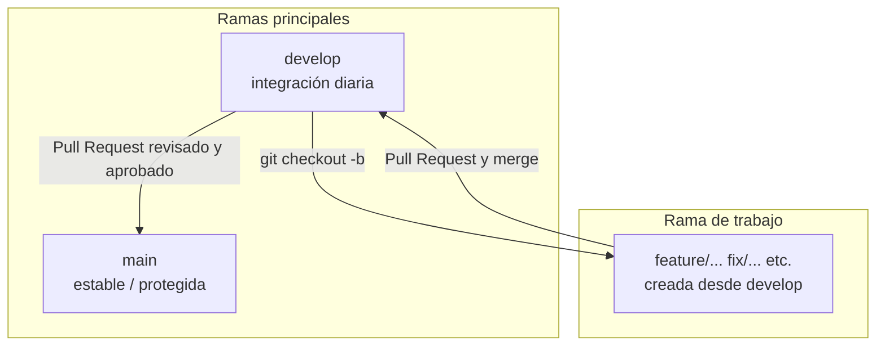

# Guía de Contribución

## Introducción

Este documento define las reglas y el flujo de trabajo para contribuir al proyecto de forma ordenada y segura. Su objetivo es que cualquier desarrolladora o desarrollador sepa cómo preparar ramas, abrir Pull Requests y colaborar sin comprometer la estabilidad del código productivo.

Seguimos un flujo **simple**: dos ramas principales (`develop` y `main`), trabajo en ramas de corta duración y integración mediante Pull Requests revisados.

## Ramas principales

| Rama | Rol |
|------|-----|
| **`main`** | Rama **productiva**, **estable** y **protegida**. Refleja lo que se considera listo para producción o entrega estable. |
| **`develop`** | Rama **base de desarrollo e integración**. Aquí se concentran los cambios validados antes de promoverlos a `main`. |

Reglas importantes:

- **`main` no debe recibir commits directos** desde el equipo de desarrollo. Solo cambios integrados mediante Pull Request y merge controlado.
- **`develop` concentra** el trabajo del equipo antes de pasar a producción. Es la referencia diaria para crear nuevas ramas de trabajo.

Ningún desarrollador debe trabajar directamente sobre `main`. Tampoco se debe trabajar directamente sobre `develop`, salvo **casos excepcionales** acordados explícitamente por el equipo.

### Reglas resumidas

- Todo cambio debe hacerse en una **rama nueva** creada desde `develop`.
- La rama de trabajo se integra en **`develop`** mediante Pull Request o merge controlado.
- Cuando los cambios estén validados en `develop`, se promueven a **`main`** mediante Pull Request desde `develop`.

## Flujo de trabajo recomendado

1. **Actualizar** la rama local `develop` con los últimos cambios del remoto.
2. **Crear una rama nueva** desde `develop` (por ejemplo `feature/nombre-del-cambio`).
3. **Implementar** los cambios solo en esa rama.
4. **Hacer commits** con mensajes claros y consistentes (ver sección [Commits](#commits)).
5. **Subir** la rama al repositorio remoto (`git push`).
6. **Abrir un Pull Request** hacia `develop`.
7. **Revisar y validar** el código en el PR (autor y revisores).
8. **Hacer merge** hacia `develop` cuando el PR esté aprobado.
9. Cuando el conjunto de cambios en `develop` esté **validado** y corresponda un corte estable, **abrir un Pull Request** desde `develop` hacia `main`.
10. **Aprobar en conjunto** y **hacer merge** hacia `main` según las reglas del equipo.

### Comandos de referencia

Ejemplos de comandos Git:

```bash
# Asegurarse de tener develop actualizada
git checkout develop
git pull origin develop

# Crear y usar una rama de trabajo
git checkout -b feature/mi-cambio

# Tras los commits, subir la rama
git push -u origin feature/mi-cambio
```

## Diagrama del flujo de ramas



En la práctica: la rama de **feature** (u otra convención) nace de `develop`, se integra en `develop` mediante Pull Request, y periódicamente `develop` se promueve a `main` mediante otro Pull Request revisado y aprobado.

## Convención de nombres de ramas

Usar prefijos en minúsculas y descripciones breves en kebab-case:

| Prefijo | Uso |
|---------|-----|
| `feature/` | Nueva funcionalidad |
| `fix/` | Corrección de errores |
| `docs/` | Solo documentación |
| `refactor/` | Refactor sin cambio funcional evidente |

Ejemplos:

- `feature/websocket-chat`
- `fix/docker-compose-postgres`
- `docs/update-architecture`
- `refactor/backend-services`

## Commits

Se recomiendan mensajes **claros** y, cuando sea posible, con un prefijo que indique el tipo de cambio:

| Prefijo | Significado |
|---------|-------------|
| `feat:` | Nueva funcionalidad |
| `fix:` | Corrección |
| `docs:` | Documentación |
| `refactor:` | Refactor |
| `test:` | Pruebas |
| `chore:` | Mantenimiento, herramientas, tareas menores |

Ejemplos:

- `feat: add websocket connection handler`
- `fix: correct postgres service configuration`
- `docs: add architecture documentation`

## Pull Requests hacia develop

Toda rama de trabajo debe integrarse **primero** en `develop` mediante Pull Request (o merge controlado equivalente acordado por el equipo).

El cuerpo del Pull Request debe ayudar a la revisión. Incluye al menos:

- **Qué** se cambió.
- **Por qué** se hizo el cambio.
- **Cómo probarlo** (pasos concretos).
- **Ámbito afectado**: backend, frontend, Docker, ML, base de datos, u otros, según aplique.

Prefiere **PR pequeños y revisables**; facilitan la revisión y reducen el riesgo de errores.

## Pull Requests hacia main

- La rama **`main`** representa **producción** o la **versión estable** del proyecto.
- Los Pull Requests hacia `main` deben abrirse **solo desde `develop`** (no desde ramas de feature sueltas).
- Los PR hacia `main` deben ser **revisados y aprobados por el equipo** antes del merge.
- La rama `main` debe estar **protegida** en GitHub (ver siguiente sección).
- **No** se permiten pushes directos a `main`.
- Se recomienda **agrupar** la promoción de `develop` a `main` en **ciclos de aproximadamente dos semanas**, salvo **correcciones urgentes** que justifiquen un corte anticipado.

## Protección de la rama main

En GitHub, la rama `main` debe configurarse con reglas de protección alineadas con este flujo. Como mínimo se recomienda:

- **Bloquear pushes directos** a `main`.
- **Exigir Pull Request** antes de permitir merge a `main`.
- **Exigir al menos una aprobación** de revisión antes del merge.
- **Exigir que las verificaciones pasen** antes del merge, **si** el repositorio tiene checks o workflows configurados (no es obligatorio tener CI/CD; si no hay checks, este punto no aplica hasta que existan).
- **No permitir force push** en `main`.
- **No permitir borrar** la rama `main`.

Ajusta los umbrales de aprobaciones y ramas adicionales según acuerdo del equipo.

## Buenas prácticas antes de abrir un Pull Request

- Comprobar que el proyecto **corre o compila localmente** según corresponda.
- **Ejecutar las pruebas** disponibles en el repositorio.
- Revisar el diff para **no subir archivos innecesarios** o generados por el IDE.
- **No subir** archivos `.env` ni secretos.
- **No subir** datasets pesados, modelos grandes, logs, cachés ni archivos temporales.
- Mantener la rama de trabajo **actualizada con `develop`** cuando el PR esté abierto o antes de la revisión final (rebase o merge según convención del equipo).

## Archivos que no deben subirse

No incluyas en el repositorio:

- **`.env`** y variables o claves sensibles.
- **Archivos temporales** y basura de editores.
- **Logs**.
- **Cachés** de herramientas o dependencias.
- **Datasets pesados** o datos masivos no versionados.
- **Documentos o datos adicionales** dentro de `data/` que no deban versionarse.
- **Modelos o artefactos pesados** de ML.
- **Archivos generados automáticamente** que puedan regenerarse.

Estas exclusiones deben reflejarse en **`.gitignore`**. Si falta alguna regla, propón su actualización en un PR dedicado (`chore:` o `docs:`).

## Checklist de Pull Request

Copia y marca en la descripción del PR cuando corresponda:

- [ ] Mi rama fue creada desde `develop`.
- [ ] El código compila o corre localmente.
- [ ] Ejecuté las pruebas disponibles.
- [ ] No incluí archivos sensibles.
- [ ] No incluí datasets, modelos pesados ni archivos temporales.
- [ ] Documenté los cambios relevantes.
- [ ] El Pull Request explica qué se cambió y cómo probarlo.

## Resolución de conflictos

Si el Pull Request muestra conflictos con `develop`:

1. Actualiza tu rama con los últimos cambios de `develop` (por ejemplo merge de `develop` en tu rama, o rebase sobre `develop`, según lo acordado por el equipo).
2. **Resuelve los conflictos en local**, ejecuta pruebas si existen y vuelve a subir los commits.

Evita dejar conflictos sin resolver hasta el último momento; facilita la revisión resolverlos **antes** de pedir la revisión final.

## Resumen del flujo

1. Crear una rama nueva desde **`develop`**.
2. Trabajar los cambios y hacer commits claros.
3. Abrir **Pull Request hacia `develop`** y validar con el equipo.
4. Integrar en **`develop`**.
5. Cuando corresponda, promover **`develop` → `main`** con un **Pull Request aprobado**.
6. Mantener **`main` estable y protegida**; nunca como rama de trabajo diaria.

Con este esquema el historial permanece trazable, las integraciones son revisables y la rama productiva queda resguardada.
